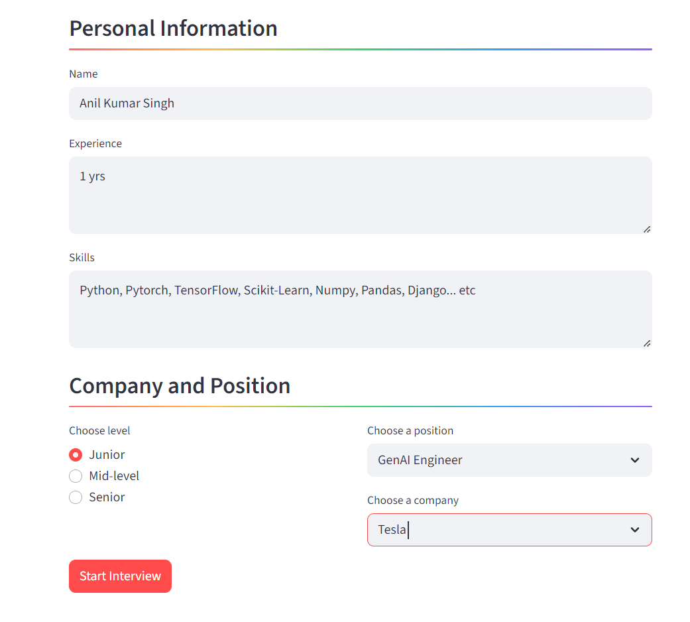
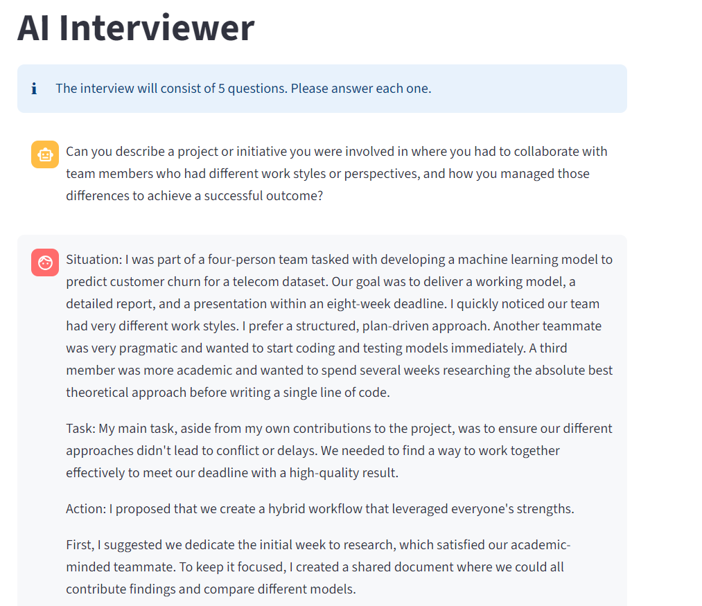
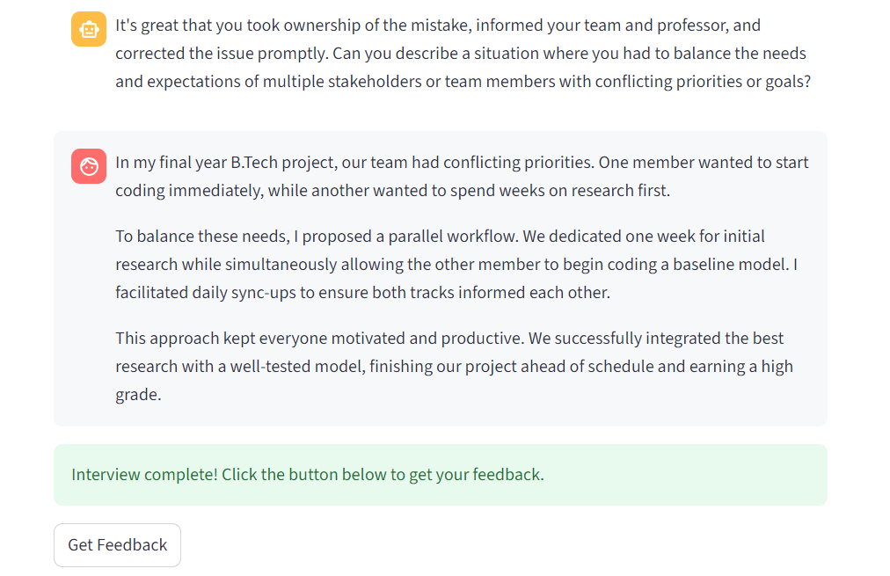
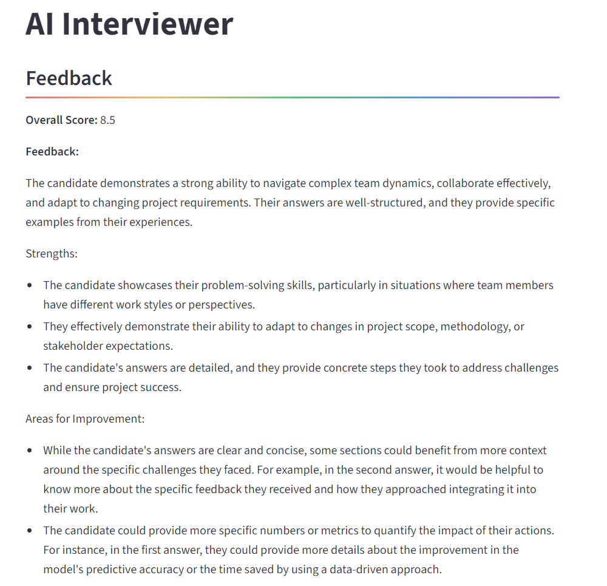
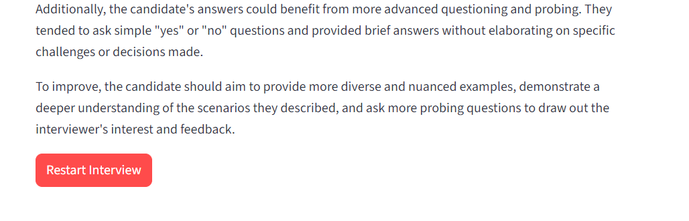

# 🤖 AI Interview Coach

[](https://github.com/AnilKumarSingh9856/HR_Interview_tool_using_streamlit/stargazers)
[](https://github.com/AnilKumarSingh9856/HR_Interview_tool_using_streamlit/network)
[](LICENSE)
[](https://www.python.org/downloads/release/python-390/)

This Streamlit application provides a platform for users to practice behavioral interviews with an AI-powered interviewer. The AI, powered by the Groq API and Llama 3, tailors the interview to a user-specified role, level, and company, and provides detailed feedback upon completion.

## 🚀 Live Demo
<a href="https://hrinterviewtool.streamlit.app/" target="_blank">

</a>

## 📸 Screenshots

<details>
<summary>Click to view application screenshots</summary>

*Setup Page*

*Interview in Progress*

*Interview Question*

*Interview Complete*

*Feedback View*


</details>

---

## ✨ Features

- **Customizable Interview Setup**: Enter your name, experience, and skills to personalize the interview.
- **Targeted Role-Playing**: Select the job level, position, and company you want to interview for.
- **Real-time AI Interaction**: Engage in a 5-question behavioral interview with a fast, responsive AI.
- **Performance Feedback**: Receive an overall score (1-10) and constructive feedback on your answers.
- **Clean, Intuitive UI**: A simple, multi-stage interface built with Streamlit.

## 🛠️ Tech Stack

- **Framework**: [Streamlit](https://streamlit.io/)
- **LLM API**: [Groq](https://groq.com/)
- **Language**: Python

---

## 🚀 Getting Started

Follow these instructions to set up and run the project on your local machine.

### Prerequisites

- Python 3.8+
- A Groq API Key. You can get one for free from the [Groq Console](https://console.groq.com/keys).

### Installation

1.  **Clone the repository:**
    ```bash
    git clone https://github.com/AnilKumarSingh9856/HR_Interview_tool_using_streamlit.git
    cd HR_Interview_tool_using_streamlit
    ```

2.  **Create and activate a virtual environment:**
    This keeps your project dependencies isolated.
    ```bash
    # For macOS/Linux
    python3 -m venv .venv
    source .venv/bin/activate

    # For Windows
    python -m venv .venv
    .venv\Scripts\activate
    ```

3.  **Install the required packages:**
    ```bash
    pip install -r requirements.txt
    ```

4.  **Configure your API Key:**
    The application uses Streamlit's built-in secrets management.

    - Create a directory named `.streamlit` in your project's root folder.
    - Inside `.streamlit`, create a file named `secrets.toml`.
    - Add your Groq API key to this file as shown below:

    ```toml
    # .streamlit/secrets.toml
    GROQ_API_KEY = "gsk_YourGroqApiKeyHere"
    ```

---

## 🏃‍♀️ Usage

1.  **Run the Streamlit application from your terminal:**
    ```bash
    streamlit run app1.py
    ```
2.  Your browser will open with the application running.
3.  Fill in the setup form with your details and the desired role.
4.  Click "Start Interview" to begin the conversation.
5.  After answering all 5 questions, click "Get Feedback" to see your performance review.
